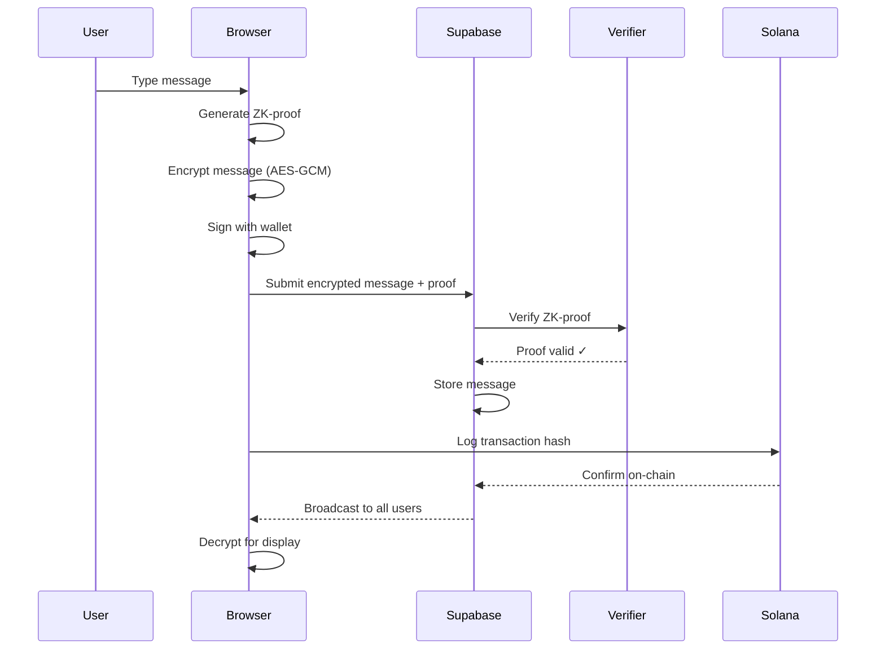

# INTRODUCING SNARK CHAT: ZK-Proof Encrypted Messaging Platform

A privacy-preserving encrypted messaging platform that uses Zero-Knowledge Proofs (ZK-SNARKs) to verify token ownership without revealing exact balances. Built on Solana with cryptographic verification.


## 🌟 Overview

This application enables users to send encrypted messages to a chat while proving they meet token-holding requirements—all without exposing their actual token balance. Every message is cryptographically verified and optionally logged to the Solana blockchain for immutable proof.

## 🔐 Key Features

- **Zero-Knowledge Proof Verification**: Prove token ownership above a threshold without revealing exact balance
- **End-to-End Encryption**: All messages are encrypted using AES-GCM before transmission
- **Blockchain Integration**: Optional on-chain logging of message hashes to Solana
- **Token Gating**: Configurable token requirements for message access
- **Real-time Chat**: Live message updates using Supabase realtime subscriptions
- **Admin Dashboard**: Manage token requirements and view system status
- **Phantom Wallet Integration**: Seamless Solana wallet connection
- **Cryptographic Signatures**: Message authenticity verified with Ed25519 signatures

## 🏗️ Architecture

### Technology Stack

**Frontend:**
- React + TypeScript + Vite
- Tailwind CSS + shadcn/ui
- Solana Web3.js + Phantom Wallet Adapter
- SnarkJS for ZK-proof generation

**Backend:**
- Supabase (Database, Auth, Edge Functions)
- Vercel Serverless Functions (ZK verification)
- Solana Blockchain (On-chain proof storage)

**Cryptography:**
- Circom circuits for ZK-SNARK constraints
- Groth16 proving system
- AES-GCM for message encryption
- Ed25519 for signature verification

## 🔬 How Zero-Knowledge Proofs Work

### The Problem
Traditional token gating requires exposing your exact token balance. This reveals sensitive financial information.

### The Solution
Zero-Knowledge Proofs allow you to prove `balance >= threshold` without revealing your actual balance.

### The Circuit

```circom
// Simplified circuit logic
template TokenBalance() {
    signal input balance;       // Private: Your actual balance
    signal input threshold;     // Public: Required minimum
    signal input salt;          // Private: Random value for privacy
    signal output commitment;   // Public: Hash of balance + salt
    
    // Constraint: balance must be >= threshold
    signal diff = balance - threshold;
    
    // Generate commitment (prevents proof reuse)
    commitment <== Poseidon([balance, salt]);
}
```

### Proof Generation Flow

1. **User connects wallet** → Fetches actual token balance
2. **Generates random salt** → Adds entropy for privacy
3. **Creates witness** → Combines balance, threshold, salt
4. **Computes proof** → Uses circuit + proving key (browser-side)
5. **Submits proof** → Sends to verifier (does NOT include balance)
6. **Verification** → Verifier checks math without seeing balance

### What's Public vs Private

| Public (Revealed) | Private (Hidden) |
|------------------|------------------|
| Threshold requirement | Your exact balance |
| Commitment hash | Salt value |
| Proof validity | Token account details |

## 🔒 How Encrypted Messaging Works

### Message Lifecycle



### Encryption Details

**Algorithm**: AES-GCM (256-bit)
**Key Derivation**: PBKDF2 with SHA-256
**IV**: Unique per message (96-bit random)

```typescript
// Encryption flow
const key = await deriveKey(passphrase);
const iv = crypto.getRandomValues(new Uint8Array(12));
const encrypted = await crypto.subtle.encrypt(
  { name: 'AES-GCM', iv },
  key,
  encoder.encode(message)
);
```

### Security Verification Chain

1. **Signature Verification**: Proves message authenticity (wallet ownership)
2. **Timestamp Check**: Prevents replay attacks (15-second window)
3. **Token Balance Verification**: Confirms user meets requirements
4. **ZK-Proof Verification**: Validates proof without revealing balance
5. **Blockchain Logging**: Creates immutable audit trail

## 📦 Project Structure

```
├── circuits/                    # ZK-SNARK circuit definitions
│   ├── tokenBalance.circom     # Main circuit logic
│   └── setup.sh                # Circuit compilation script
├── public/zkp/                 # Browser-ready ZK artifacts
│   ├── tokenBalance.wasm       # Circuit WebAssembly
│   ├── tokenBalance_final.zkey # Proving key
│   └── verification_key.json   # Verification key
├── src/
│   ├── components/             # React components
│   ├── hooks/                  # Custom React hooks
│   ├── lib/
│   │   ├── zkProof.ts         # ZK-proof generation
│   │   ├── encryption.ts      # Message encryption
│   │   ├── tokenGating.ts     # Token verification
│   │   └── solana.ts          # Blockchain interaction
│   ├── pages/
│   │   ├── Index.tsx          # Landing page
│   │   ├── Chat.tsx           # Encrypted chat
│   │   ├── Admin.tsx          # Admin dashboard
│   │   └── OnChain.tsx        # Blockchain explorer
│   └── integrations/supabase/ # Backend client
├── solana-program/             # On-chain Rust program
│   └── programs/zk-verifier/  # Solana ZK verifier
├── supabase/functions/         # Edge functions
│   ├── send-message/          # Message handler
│   ├── verify-zk-proof/       # Proof verifier
│   ├── verify-token-balance/  # Balance checker
│   └── log-to-solana/         # Blockchain logger
└── vercel-zk-verifier/        # Serverless verifier
    └── api/verify.js          # Groth16 verification
```

## 🚀 Quick Start

### Prerequisites

- Node.js 18+
- Phantom Wallet browser extension
- Solana devnet SOL (for testing)

### Installation

```bash
# Clone repository
git clone <your-repo-url>
cd <project-name>

# Install dependencies
npm install

# Start development server
npm run dev
```

### Environment Setup

The project uses Lovable Cloud (Supabase) for backend services. Environment variables are automatically configured.

### Generate ZK Circuit Artifacts

```bash
cd circuits
chmod +x setup.sh
./setup.sh
```

This compiles the circuit and generates:
- `tokenBalance.wasm` - Circuit execution code
- `tokenBalance_final.zkey` - Proving key (2.5MB)
- `verification_key.json` - Verification key

## 🎮 Usage

### For Users

1. **Connect Wallet**: Click "Connect Wallet" and approve Phantom connection
2. **Meet Requirements**: Ensure you hold the required token amount
3. **Send Message**: Type message → System auto-generates ZK-proof → Submit
4. **View Messages**: All messages decrypt automatically in chat view
5. **Blockchain Proof**: Optional on-chain logging creates permanent record

### For Admins

1. Navigate to `/admin`
2. Set token mint address (Solana token address)
3. Configure threshold amount (minimum tokens required)
4. View system statistics

## 🔧 Configuration

### Token Requirements

Edit via Admin Dashboard or database:

```sql
UPDATE token_requirements 
SET threshold_amount = 10000, 
    token_mint_address = 'YOUR_TOKEN_MINT_ADDRESS'
WHERE id = 'YOUR_REQUIREMENT_ID';
```

### Circuit Customization

Modify `circuits/tokenBalance.circom` to change proof logic, then re-run setup:

```bash
cd circuits
./setup.sh
```

## 🛡️ Security Considerations

### What This System Guarantees

✅ **Privacy**: Your exact token balance remains hidden  
✅ **Authenticity**: Messages are cryptographically signed  
✅ **Integrity**: Proofs cannot be forged or tampered with  
✅ **Immutability**: Blockchain logs provide permanent audit trail  
✅ **Access Control**: Only qualified users can send messages  

### What This System Does NOT Guarantee

❌ **Message Content Privacy from Server**: Encryption key is shared (demo purposes)  
❌ **Anonymity**: Wallet addresses are visible  
❌ **Full On-Chain Verification**: Solana program does simplified checks (full pairing verification off-chain)  

### Production Recommendations

- Implement per-user encryption keys (not shared passphrase)
- Use hardware security modules (HSM) for key management
- Enable rate limiting on message submission
- Deploy Solana program with full pairing check verification
- Conduct professional security audit before mainnet deployment

## 📊 Performance Metrics

| Operation | Time | Size |
|-----------|------|------|
| Proof Generation | ~3-5s | N/A |
| Proof Verification | ~500ms | N/A |
| Circuit Compilation | ~10s | N/A |
| Proving Key | N/A | 2.5MB |
| WASM Circuit | N/A | ~1MB |

## 🧪 Testing

### Frontend Testing

```bash
npm run test
```

### Solana Program Testing

```bash
cd solana-program
anchor test
```

### Manual Testing Flow

1. Connect wallet with sufficient tokens
2. Send test message
3. Verify message appears in chat
4. Check blockchain explorer for transaction
5. Verify proof data in database

## 🤝 Contributing

Contributions welcome! Please follow these guidelines:

1. Fork the repository
2. Create feature branch (`git checkout -b feature/AmazingFeature`)
3. Commit changes (`git commit -m 'Add AmazingFeature'`)
4. Push to branch (`git push origin feature/AmazingFeature`)
5. Open Pull Request

## 📄 License

This project is open source and available under the [MIT License](LICENSE).

## 🔗 Resources

- [Zero-Knowledge Proofs Explained](https://z.cash/technology/zksnarks/)
- [Circom Documentation](https://docs.circom.io/)
- [SnarkJS Library](https://github.com/iden3/snarkjs)
- [Solana Developer Docs](https://docs.solana.com/)
- [Groth16 Paper](https://eprint.iacr.org/2016/260.pdf)

## 💬 Support

For questions or issues:
- Open a GitHub issue
- Check existing documentation in `/docs` folders
- Review circuit setup instructions in `ZK_SETUP_INSTRUCTIONS.md`

## 🎯 Roadmap

- [ ] Multi-token support
- [ ] Enhanced privacy with Aztec protocol
- [ ] Mobile app (React Native)
- [ ] Group chat capabilities
- [ ] NFT-based access control
- [ ] Cross-chain proof verification

---

**Built with ❤️ using Zero-Knowledge Proofs, Solana, and React**
